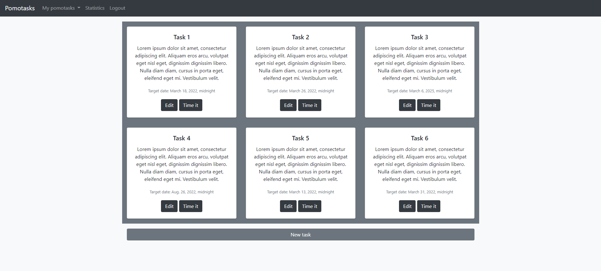
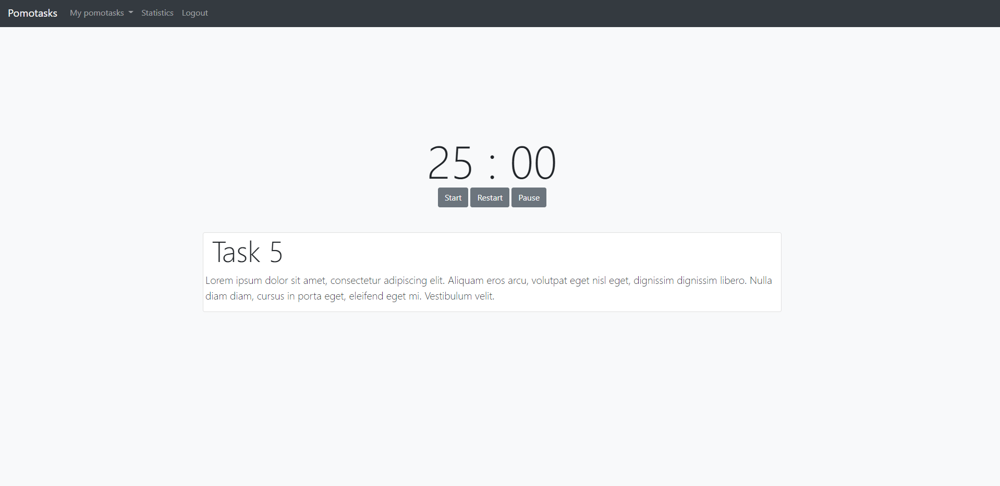

# Pomotasks

A web application project based on using Pomodoro technique. The aim of this app is to help you focus on any task you are working on, such as study, writing, or coding. Allows users to create lists of tasks with assigned categories and track the time required to complete them in a time block format of 25 minutes each. Offers progress tracking of tasks using a built-in timer.

## Sample views

